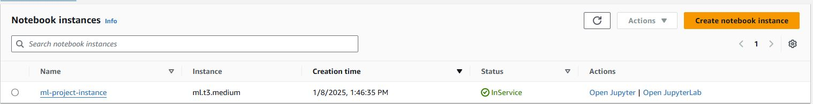

# Operationalizing an AWS ML project

## Dog Image Classification


### Step 1: Training and deployment on Sagemaker

- **SageMaker notebook instance** 
I decided to use the cost efficient ml.t3.medium. Taking into consideration limited budget this one will be enough to fulfill required expectations.



- **S3 bucket** 

I created a S3 bucket `mlproject-bucket` to store all required data


- **Deployment**
Initial training and deployment was done on a single instance `ml.m5.xlarge` instance.
Afterwards same training and deployment was done using multi instance mode on 3 `ml.m5.xlarge` 


### Step 2: EC2 Training

Next step was to create the EC2 instance for model training purposes and compare the results to SageMaker Notebook. As per the information available on Udacity page I tried to create EC2 instance based on Amazon Deep Learning AMI. However the latest Deep Learning images require base instances like:  G3, P3, P3dn, P4d, P4de, G5, G4dn, Inf1, Trn1 which are either very expensive or not available under Udacity classroom setup. After some investigation and looking for some solutions in the Udacity knowledge forum I decided to use `m5.xlarge` instance to keep costs at reasonable level.


The instance had the Deep Learning AMI GPU PyTorch 2.2.2 which allowed to run the model training job script with no additional installation required.


The image below shows the terminal connection with EC2 instance and  the saved model after running the script taken from **ec2train1.py**. 


The training process is very similar to the one done in SageMaker but it requires more manual setup and user interaction with EC2 instance to make sure that it's ready for the Python script execution. The logging and therefore visibility of the progress is limited and would require further coding. The multi-instance training using EC2 directly also requires further code development and it is not as straightforward as in SageMaker.  There is also no easy option to directly deploy the model and get a provisioned endpoint like that of SageMaker.

###  Step 3: Lambda Function Setup

- **Setting up AWS Lambda**
Next step was to setup the AWS lambda function that would use one of the model endpoints created in Step 1. As I continued this project in following day I had to rerun the model deployment section in the Notebook from Step 1 to create new endpoint (previous one were deleted to avoid costs). Lambda function enables access to our model through inferences that allows connecting by other tools.

The new endpoint name was added to the lambda function setup as per the print screen below. Before running a successful test a permission setup for lambda had to be updated.


- **Adding SageMaker permission to Lambda Functions**

For successful implementation Lambda function needs proper permissions setup which is dome through IAM settings. As Lambda will use SageMaker model therefore I decided to add below policies:


1. Amazon Lambda Full Access - for being able to execute and access functions. Deals with lambda specific operations.
2. Amazon SageMaker Full Access - for access SageMaker related services such as deployed endpoints.

###  Step 4: Security and testing

In general for any production projects based on AWS infrastructure there are few security points to consider:
- Granting full access has a potential security threat. Therefore the recommended approach is to grant the least privilege approach so attach policies the are only required to fulfill the task.
- Inactive or outdated roles can be other potential security issue, therefore such roles should be reviewed and if needed deleted
- Roles with policies for functions that the project is no longer using, can lead to unauthorized access, causing security issues. It is advisable to remove these outdated policies to prevent unauthorized access.

- **Testing Lambda function**

After attaching required policies I did a test run based on provided test case. It was successful and the results are visible below:


###  Step 5: Concurrency and auto-scaling

- **Concurrency**

Enabling concurrency for the Lambda function allows better handling of the  high traffic by allowing simultaneous responses to multiple requests. I decided to reserve 2 instances and provisioned both of them.

There are two types of concurrency to consider:

- **Provisioned concurrency**: This ensures that computing resources are readily available to handle incoming requests to a Lambda function. It is a cost-effective option; however, there is a fixed limit on the maximum number of instances. If the function receives more requests than the maximum instances, there may be processing delays.

- **Reserved concurrency**: This designates a fixed amount of computing resources specifically for a Lambda function's concurrency. These instances are always active, enabling them to handle all traffic without startup delays, which results in higher costs.

As per my configuration:

```
Reserved instances: 2 out of 900.
Provisioned instances: 2 out of 2.
```


- **Auto-scaling**

Automatic scaling is necessary for SageMaker endpoints to enable response to high traffic. I decided to use the below setup and allow up to 3 instance to be created in case of higher demand. The higher the number of instances the bigger the cost. It depends also on the instance type and time of instance running which can be controlled by scale-in and scale-out parameters (for the exercise purposes I decided to leave default parameters for these)


